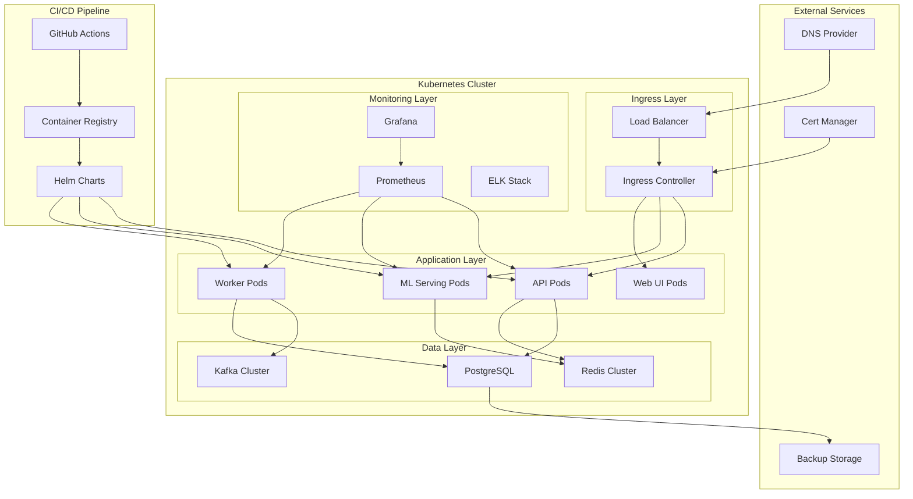

# Design Document

## Overview

The containerization and orchestration system provides a comprehensive deployment infrastructure for the pharmacogenomics ML platform. The design implements a microservices architecture using Docker containers orchestrated by Kubernetes, with automated CI/CD pipelines, monitoring, and security controls suitable for healthcare applications.

## Architecture

### High-Level Architecture



### Container Architecture

The system uses a multi-service container architecture with specialized images:

1. **API Service Container**: FastAPI application with authentication, rate limiting, and monitoring
2. **ML Serving Container**: Optimized for ML inference with GPU support and model caching
3. **Worker Container**: Background processing with Celery and queue management
4. **Database Container**: PostgreSQL with backup and replication capabilities
5. **Cache Container**: Redis cluster for session management and caching
6. **Monitoring Containers**: Prometheus, Grafana, and ELK stack for observability

## Components and Interfaces

### Docker Components

#### Multi-Stage Dockerfile Structure
```dockerfile
# Build stage - compile and install dependencies
FROM python:3.11-slim as builder
# ... build dependencies and application

# Production stage - minimal runtime environment
FROM python:3.11-slim as production
# ... copy artifacts and set up runtime

# ML Serving stage - specialized for ML workloads
FROM production as ml-serving
# ... ML-specific optimizations

# Development stage - includes dev tools
FROM builder as development
# ... development dependencies and tools
```

#### Container Optimization Features
- Multi-stage builds to minimize image size
- Non-root user execution for security
- Health checks with proper timeouts
- Signal handling for graceful shutdown
- Resource limits and monitoring
- Security scanning integration

### Kubernetes Components

#### Core Workloads
- **Deployments**: Stateless application services (API, ML, Workers)
- **StatefulSets**: Stateful services (Database, Kafka)
- **DaemonSets**: Node-level services (monitoring agents, log collectors)
- **Jobs/CronJobs**: Batch processing and maintenance tasks

#### Networking
- **Services**: Internal service discovery and load balancing
- **Ingress**: External traffic routing with SSL termination
- **NetworkPolicies**: Micro-segmentation and traffic control
- **Service Mesh**: Advanced traffic management and security

#### Storage
- **PersistentVolumes**: Durable storage for databases and file systems
- **ConfigMaps**: Application configuration management
- **Secrets**: Secure credential and certificate storage

### Helm Chart Structure
```
charts/
├── pharmacogenomics-platform/
│   ├── Chart.yaml
│   ├── values.yaml
│   ├── values-dev.yaml
│   ├── values-staging.yaml
│   ├── values-prod.yaml
│   └── templates/
│       ├── api/
│       ├── ml-serving/
│       ├── workers/
│       ├── database/
│       ├── monitoring/
│       └── ingress/
```

## Data Models

### Container Configuration Model
```yaml
apiVersion: apps/v1
kind: Deployment
metadata:
  name: api-service
  labels:
    app: pharmacogenomics
    component: api
spec:
  replicas: 3
  selector:
    matchLabels:
      app: pharmacogenomics
      component: api
  template:
    metadata:
      labels:
        app: pharmacogenomics
        component: api
    spec:
      securityContext:
        runAsNonRoot: true
        runAsUser: 1001
        fsGroup: 1001
      containers:
      - name: api
        image: pharmacogenomics/api:latest
        ports:
        - containerPort: 8000
        env:
        - name: DATABASE_URL
          valueFrom:
            secretKeyRef:
              name: database-secret
              key: url
        resources:
          requests:
            memory: "512Mi"
            cpu: "250m"
          limits:
            memory: "1Gi"
            cpu: "500m"
        livenessProbe:
          httpGet:
            path: /health
            port: 8000
          initialDelaySeconds: 30
          periodSeconds: 10
        readinessProbe:
          httpGet:
            path: /ready
            port: 8000
          initialDelaySeconds: 5
          periodSeconds: 5
```

### Service Mesh Configuration
```yaml
apiVersion: networking.istio.io/v1beta1
kind: VirtualService
metadata:
  name: api-service
spec:
  hosts:
  - api.pharmacogenomics.local
  http:
  - match:
    - uri:
        prefix: /api/v1
    route:
    - destination:
        host: api-service
        port:
          number: 8000
    fault:
      delay:
        percentage:
          value: 0.1
        fixedDelay: 5s
    retries:
      attempts: 3
      perTryTimeout: 2s
```

### Auto-scaling Configuration
```yaml
apiVersion: autoscaling/v2
kind: HorizontalPodAutoscaler
metadata:
  name: api-hpa
spec:
  scaleTargetRef:
    apiVersion: apps/v1
    kind: Deployment
    name: api-service
  minReplicas: 2
  maxReplicas: 10
  metrics:
  - type: Resource
    resource:
      name: cpu
      target:
        type: Utilization
        averageUtilization: 70
  - type: Resource
    resource:
      name: memory
      target:
        type: Utilization
        averageUtilization: 80
  - type: Pods
    pods:
      metric:
        name: http_requests_per_second
      target:
        type: AverageValue
        averageValue: "100"
```

## Error Handling

### Container Error Handling
- **Health Check Failures**: Automatic container restart with exponential backoff
- **Resource Exhaustion**: Pod eviction and rescheduling with resource adjustments
- **Image Pull Errors**: Fallback to previous image versions with alerting
- **Network Failures**: Circuit breaker patterns and retry mechanisms
- **Storage Failures**: Automatic volume remounting and data recovery procedures

### Kubernetes Error Handling
- **Node Failures**: Automatic pod rescheduling to healthy nodes
- **Service Failures**: Load balancer health checks and traffic rerouting
- **Deployment Failures**: Automatic rollback to previous stable version
- **Resource Constraints**: Cluster auto-scaling and resource optimization
- **Configuration Errors**: Validation webhooks and configuration drift detection

### CI/CD Error Handling
- **Build Failures**: Automatic retry with different build environments
- **Test Failures**: Deployment blocking with detailed failure reports
- **Security Scan Failures**: Automatic vulnerability patching and re-scanning
- **Deployment Failures**: Automatic rollback with impact assessment
- **Performance Regression**: Canary deployment with automatic rollback

## Testing Strategy

### Container Testing
1. **Unit Tests**: Test individual container components and configurations
2. **Integration Tests**: Test container interactions and service communication
3. **Security Tests**: Vulnerability scanning and penetration testing
4. **Performance Tests**: Load testing and resource utilization validation
5. **Chaos Tests**: Failure injection and resilience validation

### Kubernetes Testing
1. **Manifest Validation**: YAML syntax and Kubernetes API validation
2. **Deployment Tests**: End-to-end deployment and rollback testing
3. **Network Tests**: Service discovery and communication validation
4. **Storage Tests**: Persistent volume and backup/restore testing
5. **Scaling Tests**: Auto-scaling behavior and performance validation

### CI/CD Testing
1. **Pipeline Tests**: CI/CD workflow validation and error handling
2. **Environment Tests**: Multi-environment deployment consistency
3. **Security Tests**: RBAC, secrets management, and compliance validation
4. **Monitoring Tests**: Alerting and observability system validation
5. **Disaster Recovery Tests**: Backup, restore, and failover procedures

### Testing Tools and Frameworks
- **Container Testing**: Docker Compose, Testcontainers, Goss
- **Kubernetes Testing**: Helm test, Kustomize, Conftest
- **Security Testing**: Trivy, Falco, OPA Gatekeeper
- **Performance Testing**: K6, Artillery, Chaos Monkey
- **Monitoring Testing**: Prometheus test queries, Grafana dashboard validation

### Test Environments
1. **Local Development**: Docker Compose with minimal services
2. **CI Environment**: Kubernetes in Docker (kind) for automated testing
3. **Staging Environment**: Production-like Kubernetes cluster
4. **Production Environment**: Full-scale cluster with monitoring and alerting

### Test Data Management
- **Test Data Generation**: Synthetic data creation for testing
- **Data Isolation**: Separate databases and storage for each test environment
- **Data Cleanup**: Automated cleanup of test data and resources
- **Data Privacy**: Anonymization and masking of sensitive test data